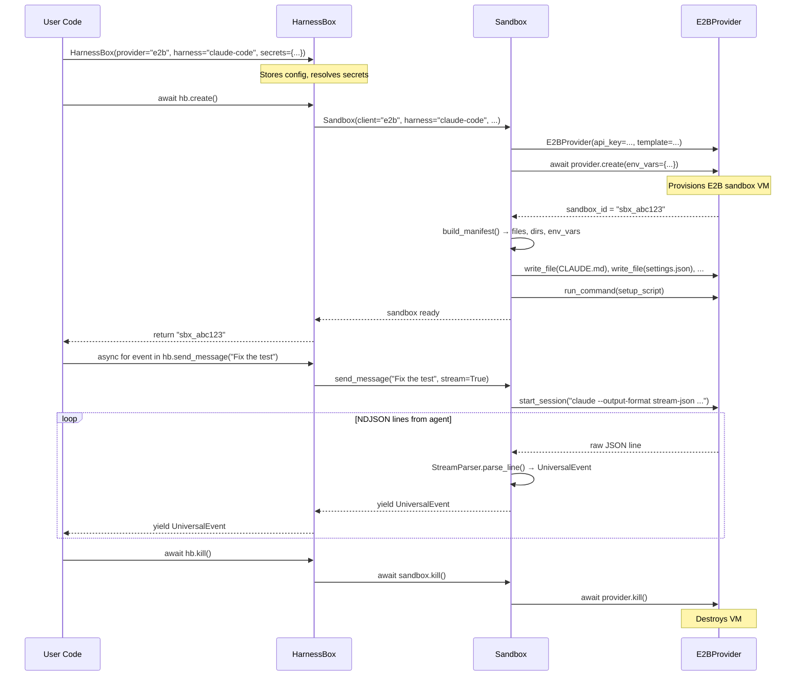
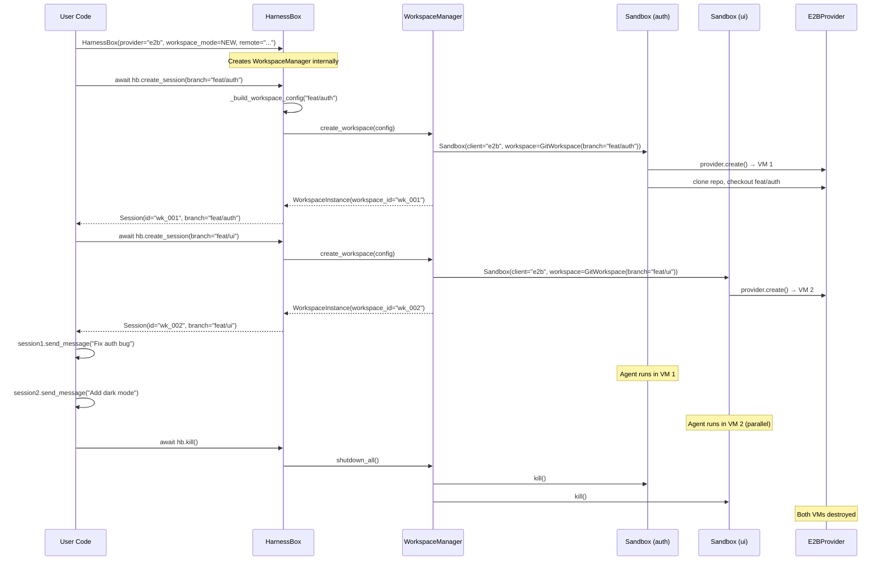
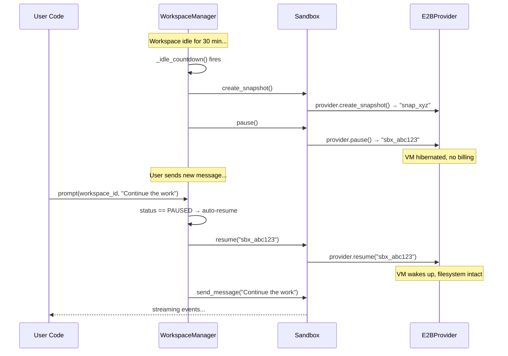

# HarnessBox SDK — Internal Architecture

## System Architecture

### Layer Diagram

```
┌─────────────────────────────────────────────────────────────────────┐
│                        User Code                                     │
│   hb = HarnessBox(provider="e2b", harness="claude-code", ...)       │
│   session = await hb.create_session(branch="feat/auth")             │
│   async for event in session.send_message("Fix the bug"):           │
└────────────────────────────────┬────────────────────────────────────┘
                                 │
┌────────────────────────────────▼────────────────────────────────────┐
│                     HarnessBox  (harnessbox.py)                      │
│                                                                      │
│  Public API facade. Separates credentials, validates input,          │
│  delegates to WorkspaceManager for multi-session orchestration.      │
│  Returns Session handles to users.                                   │
│                                                                      │
│  Single-session: owns one Sandbox directly (backwards-compat)        │
│  Multi-session: owns a WorkspaceManager that manages N Sandboxes     │
└────────────────────────────────┬────────────────────────────────────┘
                                 │
┌────────────────────────────────▼────────────────────────────────────┐
│                     Sandbox  (sandbox.py)                             │
│                                                                      │
│  Orchestrator. One Sandbox = one running agent environment.          │
│  Responsibilities:                                                   │
│    • Setup pipeline: inject CLAUDE.md, skills, security settings,    │
│      clone git workspace, run setup script                           │
│    • Agent process lifecycle: spawn harness CLI, manage PTY          │
│    • Streaming: parse NDJSON output into typed UniversalEvents       │
│    • State machine: STARTING → ACTIVE → PAUSED → ENDED/FAILED       │
│    • Cost tracking across turns                                      │
│                                                                      │
│  Does NOT know about VM provisioning — delegates to Provider.        │
└────────────────────────────────┬────────────────────────────────────┘
                                 │
┌────────────────────────────────▼────────────────────────────────────┐
│                  SandboxProvider  (providers.py)                      │
│                                                                      │
│  Protocol (structural typing). Defines ~10 raw VM operations:        │
│    create, kill, pause, resume, write_file, read_file,               │
│    make_dir, run_command, stream_command, start_session               │
│                                                                      │
│  Providers know NOTHING about agents, streaming, or setup.           │
│  They only know how to operate a remote Linux VM.                    │
└────────────────────────────────┬────────────────────────────────────┘
                                 │
              ┌──────────────────┼──────────────────┐
              ▼                  ▼                  ▼
    ┌─────────────────┐ ┌───────────────┐ ┌───────────────────┐
    │  E2BProvider    │ │ MockProvider  │ │ (future)          │
    │  (_providers/   │ │ (tests/       │ │ DaytonaProvider   │
    │   e2b.py)       │ │  conftest.py) │ │ FlyProvider       │
    │                 │ │               │ │ FirecrackerProv.  │
    │ Wraps e2b SDK   │ │ In-memory     │ │                   │
    │ + native git    │ │ dict-based    │ │                   │
    └─────────────────┘ └───────────────┘ └───────────────────┘
```

### Why Composition over Inheritance

The alternative design would be `E2BSandbox(BaseSandbox)` where each provider subclasses a base sandbox. We chose Protocol + Composition instead:

| | Protocol + Composition (current) | Inheritance (E2BSandbox extends Sandbox) |
|---|---|---|
| **Adding a provider** | One file, ~10 methods | Override 40+ methods, manage `super()` chains |
| **Testing** | Pass `MockProvider()` — tests run in 0.02s | Mock the full Sandbox or hit real infra |
| **Provider contract** | Minimal, stable (raw VM ops only) | Leaks orchestration concerns into providers |
| **Agent logic changes** | Touch Sandbox once, all providers get it | Touch every subclass |
| **Separation of concerns** | Provider = VM ops. Sandbox = agent logic. Clean seam. | Provider must understand agent lifecycle to override correctly |

The key insight: **providers don't know about agents.** E2BProvider has no idea what claude-code is. It just creates VMs and runs shell commands. All agent orchestration lives in Sandbox — one place, tested once, works with any provider.

### Happy Path: Single-Session



### Happy Path: Multi-Session



### Auto-Pause and Resume



### Module Map

| Module | Layer | Role |
|--------|-------|------|
| `harnessbox.py` | Public API | `HarnessBox` facade, `Session` handle, `WorkspaceMode` |
| `workspace_manager.py` | Orchestration | Multi-workspace registry, pooling, pause/resume, storage |
| `sandbox.py` | Orchestration | Single-sandbox lifecycle, setup pipeline, agent execution |
| `providers.py` | Contract | `SandboxProvider` Protocol definition |
| `_providers/e2b.py` | Implementation | E2B SDK wrapper (VM ops + native git) |
| `streaming.py` | Data | `UniversalEvent`, `StreamParser` (NDJSON → typed events) |
| `config/harness.py` | Config | Harness type registry (how to invoke each agent CLI) |
| `config/manifest.py` | Config | `build_manifest()` — pure function computing all files to inject |
| `security/policy.py` | Security | Deny rules, generates `settings.json` for agent |
| `security/guards.py` | Security | Credential guard definitions (bash + read + hook patterns) |
| `workspace.py` | Workspace | `GitWorkspace` — clone, commit, push via provider |
| `lifecycle.py` | State | `WorkspaceState` enum + valid transition map |
| `storage.py` | Persistence | `StorageBackend` Protocol (SQLite, memory) |
| `events.py` | Streaming | `EventBuffer` — ring buffer for SSE replay |
| `process.py` | Agent | `AgentProcess` — owns the running agent CLI process |

---

## Git Authentication Pipeline

Git auth is the critical path for sandbox sessions. An agent can't push code without working credentials. This documents the full pipeline from host credential detection to authenticated push inside the sandbox.

### Overview

```
Host Machine                          E2B Sandbox
=============                         ===========

1. Probe credentials                  4. Clone repo (native git API)
   - GITHUB_TOKEN env var                - username/password in API call
   - gh auth token (CLI)                 - token NOT stored in remote URL
   - ~/.config/gh/hosts.yml
                                      5. Set up credential persistence
2. Resolve git auth token                - remote set-url to clean HTTPS URL
   - GITHUB_TOKEN takes priority         - write .git-credentials file
   - Falls back to gh auth token         - git config credential.helper store
                                      
3. Pass token to GitWorkspace         6. Agent can now push
   - workspace.auth_token                - git push reads from .git-credentials
   - Never as env var in sandbox         - x-access-token as username
```

### Phase 1: Host Credential Detection

**File:** `credentials.py`

The `detect_credentials()` function probes the host for available API keys and CLI auth. It returns boolean availability only — values are never exposed through the API.

Probes:
- **Environment variables:** ANTHROPIC_API_KEY, OPENAI_API_KEY, E2B_API_KEY, GITHUB_TOKEN, GOOGLE_API_KEY, GEMINI_API_KEY
- **CLI configs:** gh CLI (hosts.yml), E2B CLI (config.json), Claude Code (~/.claude)
- **AWS credentials:** env vars or ~/.aws/credentials file
- **Claude auth mode:** Bedrock, Vertex, or direct API key (from ~/.claude/settings.json)

The `/v1/credentials/status` endpoint exposes this as `{name, available}` pairs so the web UI can show green/gray dots.

### Phase 2: Token Resolution

**File:** `server.py` — `_get_git_auth_token()`

When a session is created with a workspace, the server resolves a git auth token:

1. Check `GITHUB_TOKEN` environment variable
2. Run `gh auth token` to get the token from gh CLI's credential store (keychain)
3. Return `None` if neither is available

The user can also pass `auth_token` explicitly in the workspace config, which takes priority.

**Why `gh auth token`?** Modern gh CLI versions store tokens in the OS keychain, not in `hosts.yml`. The YAML file only has `user` and `git_protocol`, not the actual token. `gh auth token` is the reliable way to get it.

### Phase 3: Credential Injection

**File:** `server.py` — `_inject_host_env_vars()`

On session creation, the server auto-injects host credentials into the sandbox as environment variables:

1. Claude Code auth env vars (Bedrock/Vertex/API key)
2. All detected API keys from `_ENV_VAR_KEYS` (ANTHROPIC, OPENAI, E2B, GITHUB, GOOGLE, GEMINI)
3. User-provided env vars take priority (never overwritten)

**Git auth is NOT injected as an env var.** The git token goes through `GitWorkspace.auth_token` and is set up via git's credential helper inside the sandbox. This keeps the token out of the process environment where any tool or subprocess could read it.

### Phase 4: Clone with Auth

**File:** `workspace.py` — `_native_clone()` and `_do_clone()`

Two clone paths exist:

**Native clone (E2B):** Uses E2B's `git_clone()` API which accepts `username`/`password` directly. The token is sent over E2B's authenticated API, never appears in a shell command.

**Shell clone (fallback):** Uses `git init` + `git remote add` with the authed remote URL (`https://x-access-token:<token>@github.com/...`), then `git fetch` + `git checkout`. After clone, the remote URL is cleaned to remove the embedded token.

### Phase 5: Credential Persistence for Push

**File:** `workspace.py` — inside `_native_clone()` and `_do_clone()`

After cloning, both paths set up credentials so the agent can push later:

```
1. git remote set-url origin <clean_https_url>     # Remove token from URL
2. echo '<authed_url>' > <workspace>/.git-credentials  # Write credentials file
3. git config credential.helper 'store --file <workspace>/.git-credentials'
```

The `.git-credentials` file format is standard git: `https://x-access-token:<token>@github.com/owner/repo.git`

Git's `store` helper reads this file on push and provides the credentials automatically.

**Why not env vars?** `GITHUB_TOKEN` or `GH_TOKEN` as env vars would be readable by any process in the sandbox. The credential helper approach limits exposure to git operations only.

**Why `store` and not a shell script helper?** Previous attempts used `!echo` and `!printf` as inline credential helpers. These broke because:
- `echo` with `\n` inside single quotes outputs literal `\n`, not newlines
- `printf` with `\n` worked for output but the git credential protocol wasn't being honored correctly
- The token got URL-encoded into the remote URL instead of being passed through the credential protocol

The `store` helper is built into git, handles the protocol correctly, and is well-tested.

**Why `--file <workspace>/.git-credentials`?** E2B sandboxes don't allow writing to `/root/`. The default `store` helper writes to `~/.git-credentials` which resolves to `/root/.git-credentials`. Using `--file` with the workspace directory works in all sandbox environments.

### Branch Management

Sessions create local branches named after city names (e.g., `tokyo`, `rapture`), branching off the remote's default branch:

```
git clone <remote> --branch main      # Clone base branch
git checkout -b tokyo                  # Create local working branch
```

The `base_branch` field tracks what the session branched from. The `branch` field tracks the current working branch name.

Branch rename (`POST /v1/sessions/{id}/rename`) runs `git branch -m <old> <new>` in the sandbox and updates both `SessionInfo.branch` and `SessionInfo.workspace_name`.

### Security Considerations

**Token exposure surface:**
- The git auth token is stored in `.git-credentials` inside the sandbox filesystem
- Any process running in the sandbox can read this file
- The token is NOT in environment variables, limiting casual exposure
- The token has whatever scopes the user's `gh auth` or `GITHUB_TOKEN` has (typically `repo` scope)

**Token lifetime:**
- Tokens from `gh auth token` are OAuth tokens that persist until revoked
- `GITHUB_TOKEN` from env vars may be short-lived (e.g., CI tokens)
- The `.git-credentials` file persists for the sandbox lifetime only

**What an agent can do with the token:**
- Push to any repo the token has access to (not just the cloned one)
- Create PRs, read private repos, manage webhooks (depending on token scopes)
- The security policy and credential guards mitigate this by blocking certain tool patterns

**What we DON'T do:**
- We don't scope the token to a single repo (GitHub fine-grained tokens could, but most users have classic tokens)
- We don't rotate the token during the session
- We don't audit which git operations used the token

### Tradeoffs

| Decision | Pro | Con |
|----------|-----|-----|
| `store` helper over env var | Token not in process env | Still readable from filesystem |
| `gh auth token` over YAML parsing | Works with keychain-based auth | Requires `gh` CLI on host |
| Credentials in workspace dir | Works in restricted sandboxes | Token on filesystem, not memory-only |
| Single token for clone + push | Simple, no token rotation needed | Token has full repo scope |
| City names as branch names | Unique, no conflicts across sessions | Not descriptive (user must rename) |

### Future Improvements

1. **Fine-grained GitHub tokens:** Use GitHub's fine-grained personal access tokens scoped to a single repo. Would require repo-specific token generation at session creation time.

2. **Token rotation:** Refresh or rotate the credential during long-running sessions. OAuth tokens from `gh auth` can expire.

3. **git-credential-manager:** Use GCM (Git Credential Manager) which handles OAuth flows, token caching, and multi-account scenarios. Would need GCM installed in the E2B template.

4. **SSH keys instead of HTTPS:** Deploy an ephemeral SSH key per session. More secure (key can be scoped and revoked), but requires SSH agent setup in the sandbox and deploy key registration on GitHub.

5. **Audit logging:** Log which git operations used the credential helper, when pushes happen, and what was pushed. The EventHandler system could capture these.

6. **Credential guard for .git-credentials:** Add `.git-credentials` to the read-deny list in security policy so agents can't cat the file directly (git's credential helper still works because git reads it internally).
